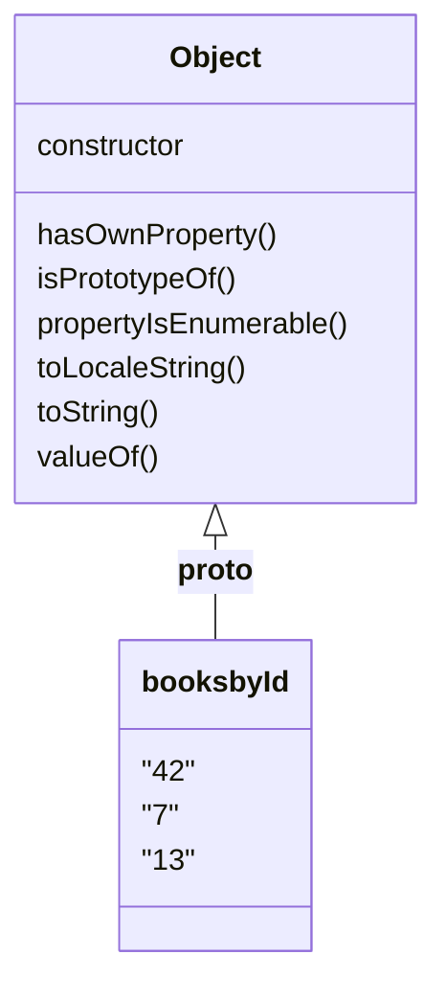
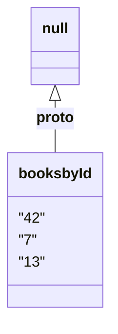

---
layout: intro
class: text-center
---

# You Should Be Using
# Maps and Sets

---
layout: intro
class: text-xl
---

# CJ

- github.com/w3cj
- @w3cj on Discord 
- twitter.com/Coding_Garden
- cj@null.computer

---

---
class: text-xl
---

# whoami

<v-clicks depth="2">

- Co-organizer of DenverScript
- Host of Coding Garden on Twitch and YouTube
  - twitch.tv/CodingGarden
  - youtube.com/@CodingGarden
- Senior Creator @ Syntax.fm / Sentry
  - sentry.io
  - youtube.com/@syntaxfm

</v-clicks>

---
layout: image
image: ./images/syntax-689.jpg
backgroundSize: contain
---

---
layout: intro
class: text-center
---

# The Problem with Objects
# The Case for Maps

---

````md magic-move
```ts
const booksById = {};

export default booksById;
```

```ts
const booksById = {
  42: {
    id: 42,
    title: "Hitchiker's Guide To the Galaxy",
    authors: ["Adams, Douglas"],
  },
};

export default booksById;
```

```ts
const booksById = {
  42: {
    id: 42,
    title: "Hitchiker's Guide To the Galaxy",
    authors: ["Adams, Douglas"],
  },
  7: {
    id: 7,
    title: "Secrets of the JavaScript Ninja",
    authors: ["Resig, John", "Bibeault, Bear", "Maras, Josip"],
  },
};

export default booksById;
```

```ts
const booksById = {
  42: {
    id: 42,
    title: "Hitchiker's Guide To the Galaxy",
    authors: ["Adams, Douglas"],
  },
  7: {
    id: 7,
    title: "Secrets of the JavaScript Ninja",
    authors: ["Resig, John", "Bibeault, Bear", "Maras, Josip"],
  },
  13: {
    id: 13,
    title: "Don't Make Me Think",
    authors: ["Krug, Steve"],
  },
};

export default booksById;
```
````

---

```js {monaco-run}  { showOutputAt:'+1', editorOptions: { fontSize: 20 } }
import booksById from "./books-by-id";

function getBook(id) {
  return booksById[id];
}

console.log(getBook(42));
```

---

```js {monaco-run} { showOutputAt:'+1', editorOptions: { fontSize: 20 } }
import booksById from "./books-by-id";

function getBook(id) {
  return booksById[id];
}

console.log(getBook("42"));
```

---

````md magic-move
```js {1-17|2,7,12|1-17}
const booksById = {
  42: {
    id: 42,
    title: "Hitchiker's Guide To the Galaxy",
    authors: ["Adams, Douglas"],
  },
  7: {
    id: 7,
    title: "Secrets of the JavaScript Ninja",
    authors: ["Resig, John", "Bibeault, Bear", "Maras, Josip"],
  },
  13: {
    id: 13,
    title: "Don't Make Me Think",
    authors: ["Krug, Steve"],
  },
};
```
```js
const booksById = {
  "42": {
    id: 42,
    title: "Hitchiker's Guide To the Galaxy",
    authors: ["Adams, Douglas"],
  },
  "7": {
    id: 7,
    title: "Secrets of the JavaScript Ninja",
    authors: ["Resig, John", "Bibeault, Bear", "Maras, Josip"],
  },
  "13": {
    id: 13,
    title: "Don't Make Me Think",
    authors: ["Krug, Steve"],
  },
};
```
````

---

```js {monaco-run} { showOutputAt:'+1', editorOptions: { fontSize: 20 } }
import booksById from "./books-by-id";

function getBook(id) {
  return booksById[id];
}

console.log(getBook("constructor"));
```

---
layout: center
---



---

````md magic-move
```js
import booksById from "./books-by-id";

function getBook(id) {
  return booksById[id];
}

console.log(getBook("constructor"));
```

```js
import booksById from "./books-by-id";

function getBook(id) {
  if (booksById.hasOwnProperty(id)) {
    return booksById[id];
  }
}

console.log(getBook("constructor"));
```
````

---

```js {monaco-run} { showOutputAt:'+1', editorOptions: { fontSize: 20 } }
import booksById from "./books-by-id";

function getBook(id) {
  if (booksById.hasOwnProperty(id)) {
    return booksById[id];
  }
}

console.log(getBook("constructor"));
```

---

<<< @/snippets/books-by-id-null-prototype.ts#snippet

---

```js {monaco-run} { showOutputAt:'+1', editorOptions: { fontSize: 20 } }
import booksById from "./books-by-id-null-prototype";

function getBook(id) {
  if (booksById.hasOwnProperty(id)) {
    return booksById[id];
  }
}

console.log(getBook("constructor"));
```

---
layout: center
---



---


````md magic-move
```js
import booksById from "./books-by-id-null-prototype";

function getBook(id) {
  if (booksById.hasOwnProperty(id)) {
    return booksById[id];
  }
}

console.log(getBook("constructor"));
```

```js {4-7|6|4-5|7|1-12}
import booksById from "./books-by-id-null-prototype";

function getBook(id) {
  if (Object
    .prototype
    .hasOwnProperty
    .call(booksById, id)) {
    return booksById[id];
  }
}

console.log(getBook("constructor"));
```
```js
import booksById from "./books-by-id-null-prototype";

function getBook(id) {
  if (Object
    .prototype
    .hasOwnProperty
    .call(booksById, id)) {
    return booksById[id];
  }
}

console.log(getBook("constructor"));
```
```js {4|1-12}
import booksById from "./books-by-id-null-prototype";

function getBook(id) {
  if (Object.hasOwn(booksById, id)) {
    return booksById[id];
  }
}

console.log(getBook("constructor"));
```
````

---

```js {monaco} { editorOptions: { fontSize: 40 } }
Object
  .prototype
  .hasOwnProperty
  .call(thing, 'prop')
```

---

````md magic-move
```js
const booksById = new Map();
```
```js
const booksById = new Map();
booksById.set(42, {
  id: 42,
  title: "Hitchiker's Guide To the Galaxy",
  authors: ["Adams, Douglas"],
});
```
````

---

```js {monaco-run} { showOutputAt:'+1', editorOptions: { fontSize: 20 } }
const booksById = new Map();
booksById.set(42, {
  id: 42,
  title: "Hitchiker's Guide To the Galaxy",
  authors: ["Adams, Douglas"],
});
console.log(booksById.has(42));
console.log(booksById.has("constructor"));
```

---

```js {monaco-run} { showOutputAt:'+1', editorOptions: { fontSize: 20 } }
const booksById = new Map();
booksById.set(42, {
  id: 42,
  title: "Hitchiker's Guide To the Galaxy",
  authors: ["Adams, Douglas"],
});
console.log(booksById.has("42"));
```

---

```js {monaco-run} { showOutputAt:'+1', editorOptions: { fontSize: 20 } }
const booksById = new Map();
booksById.set(42, {
  id: 42,
  title: "Hitchiker's Guide To the Galaxy",
  authors: ["Adams, Douglas"],
});
console.log(booksById.get(42));
```

---

```ts {monaco} { editorOptions: { fontSize: 20 } }
type Book = { id: number; title: string; authors: string[] };

const booksById = new Map<number, Book>();
booksById.set(42, {
  id: 42,
  title: "Hitchiker's Guide To the Galaxy",
  authors: ["Adams, Douglas"],
});
booksById.set("wat", "no")
```

---

````md magic-move
```js
const booksById = new Map()
```
```js
const booksById = new Map([

])
```
```js
const booksById = new Map([
  [key, value],
  [key, value],
  [key, value]
])
```
```js
const booksById = new Map([
  [],
])
```
```js
const booksById = new Map([
  [42, {}]
])
```
```js
const booksById = new Map([
  [42, {
    id: 42,
    title: "Hitchiker's Guide To the Galaxy",
    authors: ["Adams, Douglas"],
  }]
])
```
````

---

<<< @/snippets/books-array.ts#snippet

---

````md magic-move
```js
import books from './books-array';

const booksById = new Map();
```
```js
import books from './books-array';

const booksById = new Map(
  
);
```
```js
import books from './books-array';

const booksById = new Map(
  books.map()
);
```
```js
import books from './books-array';

const booksById = new Map(
  books.map((book) => )
);
```
```js
import books from './books-array';

const booksById = new Map(
  books.map((book) => [])
);
```
```js
import books from './books-array';

const booksById = new Map(
  books.map((book) => [book.id, book])
);
```
````

---

```js  {monaco-run}  { showOutputAt:'+1', editorOptions: { fontSize: 20 } }
import books from './books-array';

const booksById = new Map(
  books.map((book) => [book.id, book])
);

console.log(booksById);
```

---

```js  {monaco-run}  { showOutputAt:'+1', editorOptions: { fontSize: 20 } }
import books from './books-array';

const booksById = new Map(
  books.map((book) => [book.id, book])
);

function getBook(id) {
  return booksById.get(id);
}

console.log(getBook("constructor"));
console.log(getBook("42"));
```

---

```js  {monaco-run}  { showOutputAt:'+1', editorOptions: { fontSize: 20 } }
import books from './books-array';

const booksById = new Map(
  books.map((book) => [book.id, book])
);

function getBook(id) {
  return booksById.get(id);
}

console.log(getBook(42));
```

---

# When To Use Maps

<v-clicks depth="2">

- Need to dynamically look up items by key
- Need to dynamically create a key / value pair
- Need keys to be a specific type, not just string

</v-clicks>

---
layout: intro
class: text-center
---

# The Problem with Arrays
# The Case for Sets

---

````md magic-move
```js
const cart = {
  bookIds: [42, 7, 13]
};
```
```js
const cart = {
  bookIds: [42, 7, 13]
};

function isInCart(bookId) {
  
}
```
```js
const cart = {
  bookIds: [42, 7, 13]
};

function isInCart(bookId) {
  return cart.bookIds.includes(bookId);
}
```
````

---

```js {monaco-run}  { showOutputAt:'+1', editorOptions: { fontSize: 20 } }
const cart = {
  bookIds: [42, 7, 13]
};

function isInCart(bookId) {
  return cart.bookIds.includes(bookId);
}

console.log(isInCart(42))
console.log(isInCart(99))
```

---

```js {1-7|6}
const cart = {
  bookIds: [42, 7, 13]
};

function isInCart(bookId) {
  return cart.bookIds.includes(bookId);
}
```

---

````md magic-move
```js
const cart = {
  bookIds: [42, 7, 13]
};

function isInCart(bookId) {

}
```
```js
const cart = {
  bookIds: [42, 7, 13]
};

function isInCart(bookId) {
  for (let i = 0; i < cart.bookIds.length; i++) {

  }

}
```
```js
const cart = {
  bookIds: [42, 7, 13]
};

function isInCart(bookId) {
  for (let i = 0; i < cart.bookIds.length; i++) {
    if (cart.bookIds[i] === bookId) {

    }
  }

}
```
```js
const cart = {
  bookIds: [42, 7, 13]
};

function isInCart(bookId) {
  for (let i = 0; i < cart.bookIds.length; i++) {
    if (cart.bookIds[i] === bookId) {
      return true;
    }
  }
  return false;
}
```
```js
const cart = {
  bookIds: [
    52, 45, 12, 38, 28, 83, 33, 19, 26, 68, 
    40, 96, 77, 54, 3, 18, 88, 29, 11, 57, 
    81, 15, 35, 89, 66, 44, 84, 94, 92, 25, 
    72, 5, 6, 90, 59, 21, 30, 62, 85, 48, 
    7, 87, 2, 50, 23, 36, 93, 42, 43, 31, 
    58, 70, 8, 10, 49, 69, 71, 80, 53, 56, 
    78, 41, 1, 75, 91, 60, 79, 22, 20, 27, 
    13, 55, 4, 24, 76, 9, 86, 98, 63, 97, 
    74, 73, 82, 17, 32, 61, 37, 47, 14, 64, 
    39, 95, 34, 16, 99, 67, 46, 51, 65, 100
  ]
};

function isInCart(bookId) {
  for (let i = 0; i < cart.bookIds.length; i++) {
    if (cart.bookIds[i] === bookId) {
      return true;
    }
  }
  return false;
}
```
````

---

````md magic-move
```js
const cart = {
  bookIds: [42, 7, 13]
};

function isInCart(bookId) {

}
```
```js
const cart = {
  bookIds: new Set([42, 7, 13])
};

function isInCart(bookId) {

}
```
```js
const cart = {
  bookIds: new Set([42, 7, 13])
};

function isInCart(bookId) {
  return cart.bookIds.has(bookId);
}
```
````

---

# When To Use Sets

<v-clicks depth="2">

- Need to Keep Track of Unique Values
- Need Constant Time Lookup of Values

</v-clicks>

---
layout: intro
class: text-center
---

# You Should Be Using
# Maps and Sets

---
layout: two-cols
---

# CJ

- github.com/w3cj
- @w3cj on Discord 
- twitter.com/Coding_Garden
- cj@null.computer

::right::

<v-clicks>

# Thank You!

</v-clicks>
